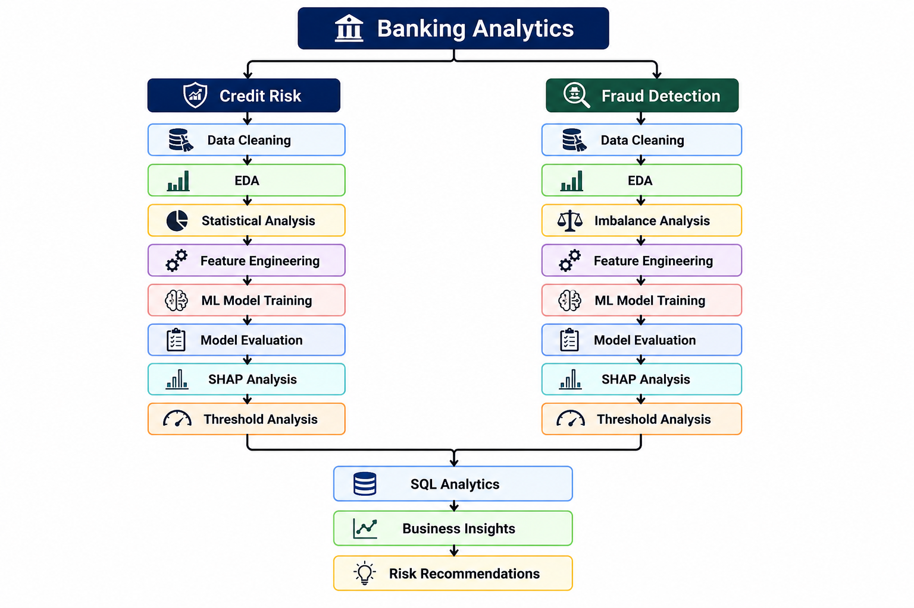

# 🏦 Banking Credit Risk & Fraud Analytics

## 📌 Project Overview

This project is an end-to-end banking analytics and machine-learning solution covering two major financial-risk problems:

1. Credit Risk / Loan Default Prediction
2. Credit Card Fraud Detection

The project combines exploratory data analysis, statistical analysis, feature engineering, machine learning, model evaluation, explainability, SQL analytics, and business-risk segmentation.

The objective is to demonstrate how data science can support practical banking decisions such as:

- Loan approval and risk assessment
- Portfolio risk monitoring
- Customer risk segmentation
- Fraud detection
- Fraud investigation prioritization
- Risk-based decision-making

---

# 🎯 Business Problems

## 1. Credit Risk

Financial institutions need to identify borrowers who are more likely to default on loans.

The project analyzes borrower and loan characteristics and develops machine-learning models to predict loan default.

The target variable is:

- `0` → Non-default
- `1` → Default

### Business Objective

Predict borrowers with elevated default risk so that lenders can make better-informed credit decisions.

---

## 2. Fraud Detection

Credit-card fraud is a highly imbalanced classification problem because fraudulent transactions represent a very small proportion of total transactions.

The project develops machine-learning models to identify potentially fraudulent transactions.

The target variable is:

- `0` → Legitimate
- `1` → Fraud

### Business Objective

Identify fraudulent transactions while balancing:

- Fraud detection
- False positives
- Customer experience
- Financial exposure

---

# 🏗️ Project Architecture

This project follows an end-to-end banking analytics workflow covering credit risk assessment, fraud detection, model explainability, threshold optimization, SQL analytics, and business recommendations.